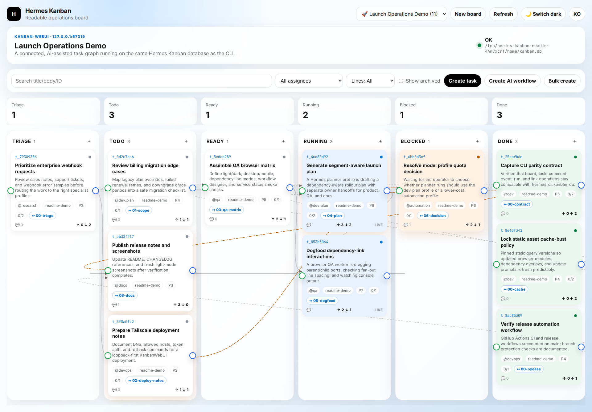
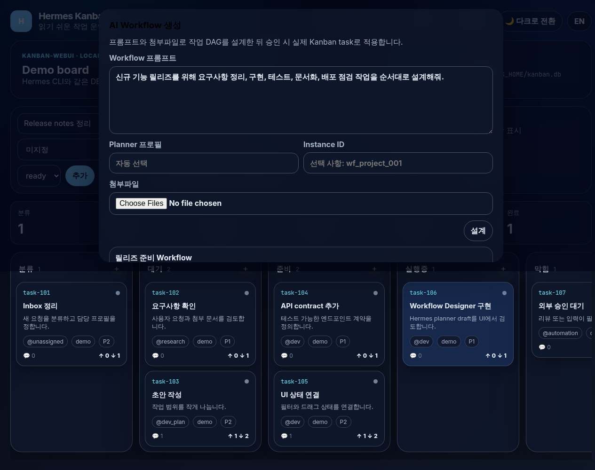

# Hermes KanbanWebUI

Standalone, Trello-like WebUI for the Hermes Agent Kanban database.

KanbanWebUI is intentionally a thin Web/API layer over Hermes' existing
`hermes_cli.kanban_db` module. It does **not** create a new task schema,
dispatcher, or worker protocol. The Hermes CLI and this WebUI read/write the
same SQLite board data.

## Screenshots



The main board screenshot is captured in light mode with English demo data. It
shows the same Hermes Kanban tasks as the CLI, with responsive columns, filters,
task creation, drag-and-drop status changes, running work, and visible
parent/child dependency lines across a multi-step launch workflow.



The AI Workflow Designer screenshot is also light-mode English UI. It shows a
prompt, planner profile, revision prompt, warnings, and a generated step-by-step
task DAG before any real Kanban tasks are created.

## Features

This project separates what already belongs to Hermes Agent from what the WebUI
adds on top. The WebUI is a companion interface, not a replacement task runner.

### Hermes Agent core

Hermes Agent already provides the core Kanban execution model:

- Shared SQLite Kanban schema and database access through
  `hermes_cli.kanban_db`.
- CLI task lifecycle operations such as init, board management, create/list/show,
  assign, claim, heartbeat, comment, complete, block, unblock, archive, stats,
  logs, context, dispatch, and garbage collection.
- Task states used by the worker flow: `triage`, `todo`, `ready`, `running`,
  `blocked`, `done`, and archived tasks.
- Task metadata for comments, events, runs, logs, and parent-child dependencies
  stored as normal Hermes Kanban records.
- Profile-based dispatch: a `ready` task with an assignee/profile can be claimed
  and executed by Hermes workers using the built-in `kanban-worker` skill.
- Hermes-wide concerns such as model/provider configuration, skills, toolsets,
  gateway platforms, memory, credentials, and profile isolation.

### KanbanWebUI additions

KanbanWebUI adds a browser-first operations layer over that existing Hermes
Kanban data:

- Responsive Trello-style board columns for `triage`, `todo`, `ready`,
  `running`, `blocked`, and `done`.
- Task creation dialog, bulk task creation, board CRUD/switching, filters,
  search, archive visibility, and drag-and-drop status changes.
- Task detail drawer with editable metadata/body, comments, events, runs,
  markdown rendering, dependency controls, home-channel notification toggles,
  and a Live Run Monitor for running tasks.
- Global Operations panel for running tasks, heartbeat/claim health, retry
  candidates, blocked-after-retry failures, and recent failure events.
- Dependency visualization on the board and task drawer, including focus/all/
  blocked/off display modes, so parent/child relationships are visible without
  leaving the browser.
- Prompt-driven AI Workflow Designer: enter a goal plus optional text files,
  review/revise the proposed task DAG, then apply it as normal Kanban tasks with
  parent-child dependencies.
- Workflow draft storage, board-scoped draft APIs, immutable applied drafts, and
  backend guards that prevent non-applyable AI proposals from being applied.
- Traditional Chinese (`zh-Hant`) UI by default with an English toggle and
  optional Korean translation, plus light/dark themes.
- Optional token auth for `/api/*` endpoints.
- Loopback-first runtime with Host-header and cross-origin mutation checks for
  safer localhost/Tailscale usage.
- Safe in-app update prompt for clone-based installs: the WebUI checks
  `origin/main`, lists incoming commits, and only applies fast-forward updates
  from a clean local `main` checkout.
- Automatic PR review tasks require reviewers to run
  `./scripts/hermes-kanban github-auth-preflight` before local review work so
  missing GitHub posting auth is surfaced early.

### Automatic PR review GitHub auth preflight

Reviewer tasks created from implementation PR handoffs must post their result on
GitHub, not only in Kanban. Before reading the diff or running tests, run:

```bash
./scripts/hermes-kanban github-auth-preflight
```

The preflight succeeds when this exact reviewer runtime has authenticated `gh`
(`gh auth status`) or a non-empty `GH_TOKEN`/`GITHUB_TOKEN`. If it prints
`GitHub PR review posting is blocked`, block the Kanban review task with that
actionable message and fix the runtime with `gh auth login` or by exporting
`GH_TOKEN`/`GITHUB_TOKEN` through normal Hermes/profile environment handling.
Do not paste token values into task comments or logs.

## Requirements

- Python 3.11+
- [`uv`](https://docs.astral.sh/uv/) on `PATH`
- A Hermes Agent source checkout or installation that exposes
  `hermes_cli.kanban_db`

If Hermes is not importable from your Python environment, set
`HERMES_AGENT_ROOT` to the Hermes Agent checkout that contains
`hermes_cli/kanban_db.py`:

```bash
export HERMES_AGENT_ROOT="$HOME/.hermes/hermes-agent"
```

## Quick install from Git

```bash
git clone https://github.com/daily-language-3mins/HermesKanban.git ~/.local/share/hermes-kanban
cd ~/.local/share/hermes-kanban
./scripts/install.sh
hermes-kanban doctor
hermes-kanban start
```

Open <http://127.0.0.1:8790>.

The installer creates/uses:

- `~/.local/bin/hermes-kanban` — lifecycle command wrapper.
- `~/.hermes/kanban-webui.env` — local configuration copied from `.env.example`.
- `~/.hermes/kanban-webui/` — pid/state directory.
- `~/.hermes/logs/kanban-webui.log` — service log.

Manual clone-and-run still works if you prefer not to install the wrapper:

```bash
export HERMES_AGENT_ROOT="$HOME/.hermes/hermes-agent"
uv run python server.py --host 127.0.0.1 --port 8790
```

`uv run` creates/uses `.venv` automatically from `pyproject.toml`.

## Configuration

| Variable | Default | Purpose |
| --- | --- | --- |
| `HERMES_AGENT_ROOT` | unset | Hermes Agent checkout containing `hermes_cli/kanban_db.py` when Hermes is not installed/importable. |
| `HERMES_KANBAN_WEBUI_APP_DIR` | repo checkout path | HermesKanban checkout used by the `hermes-kanban` wrapper. |
| `HERMES_KANBAN_WEBUI_ENV` | `$REAL_HOME/.hermes/kanban-webui.env` | Env file sourced by the `hermes-kanban` wrapper. |
| `HERMES_KANBAN_WEBUI_HOST` | `127.0.0.1` | Bind host. Keep loopback unless you have a trusted reverse proxy/Tailscale-only proxy. |
| `HERMES_KANBAN_WEBUI_PORT` | `8790` | HTTP port. |
| `HERMES_KANBAN_HOST` / `HERMES_KANBAN_PORT` | unset | Short aliases accepted by the wrapper; exported as `HERMES_KANBAN_WEBUI_*`. |
| `HERMES_KANBAN_WEBUI_STATE` | `$REAL_HOME/.hermes/kanban-webui` | Runtime state directory for pid files and local service metadata. |
| `HERMES_KANBAN_WEBUI_LOG` | `$REAL_HOME/.hermes/logs/kanban-webui.log` | Log file used by the helper script. |
| `HERMES_KANBAN_WEBUI_TOKEN` | unset | Optional API token. When set, `/api/*` and `/service/status` require auth. |
| `HERMES_KANBAN_WEBUI_ALLOWED_HOSTS` | unset | Comma-separated DNS hostnames allowed by Host-header validation, e.g. a Tailscale MagicDNS name. |
| `HERMES_REAL_HOME` | auto-detected | Override for the real OS home when running inside a Hermes profile HOME. |
| `HERMES_KANBAN_WORKFLOW_AI_ENABLED` | `true` | Enables AI workflow draft generation. Set `0`/`false`/`off` to disable. |
| `HERMES_KANBAN_WORKFLOW_PLANNER_PROFILE` | auto | Preferred Hermes planner profile. Fallback is request value → env → `dev_plan` if present → `default` if present → first on-disk profile. |
| `HERMES_KANBAN_WORKFLOW_DEFAULT_MAX_STEPS` | `8` | Default maximum steps requested from the planner. |
| `HERMES_KANBAN_WORKFLOW_MAX_STEPS` | `20` | Hard maximum accepted workflow steps. |
| `HERMES_KANBAN_WORKFLOW_ATTACHMENT_MAX_FILES` | `5` | Maximum text attachments per workflow draft. |
| `HERMES_KANBAN_WORKFLOW_ATTACHMENT_MAX_BYTES` | `200000` | Maximum bytes per text attachment. |
| `HERMES_KANBAN_WORKFLOW_PLANNER_TIMEOUT_SECONDS` | `180` | Timeout for the Hermes CLI planner call. |

State/log defaults resolve to the real OS home when possible, not to Hermes'
profile HOME such as `~/.hermes/profiles/<profile>/home`.

## Lifecycle command

After `./scripts/install.sh`, manage the app with:

```bash
hermes-kanban start
hermes-kanban status
hermes-kanban logs
hermes-kanban logs -f
hermes-kanban restart
hermes-kanban stop
hermes-kanban open
```

Run diagnostics:

```bash
hermes-kanban doctor
```

The wrapper reads `~/.hermes/kanban-webui.env` by default. To use another env
file:

```bash
HERMES_KANBAN_WEBUI_ENV=/path/to/kanban-webui.env hermes-kanban start
```

The legacy repo-local scripts remain available:

```bash
scripts/hermes-kanban-webui-start
scripts/hermes-kanban-webui-stop
```

If you copy only those legacy scripts to another directory such as
`~/.local/bin`, also set `HERMES_KANBAN_WEBUI_APP_DIR`.

The start script uses `uv` from `PATH`, or `UV=/absolute/path/to/uv` if you need
to override it.

## In-app self-update

Clone-based installs can update from the browser when a newer `origin/main` is
available. The WebUI polls `GET /api/app/update-status`, shows incoming commit
subjects, and applies updates through `POST /api/app/update`.

The updater is intentionally conservative:

- Fixed target: `origin/main` only.
- Requires the current branch to be `main`.
- Refuses dirty working trees, diverged history, non-fast-forward updates, and
  missing `git`/remote prerequisites.
- Runs `git pull --ff-only origin main`, then `uv sync`, then restarts the
  current server process so the browser can reload onto the new code.

If the checkout is intentionally edited locally, update it with Git manually
instead of using the browser prompt.

## systemd user service

The preferred install path is generated from your env file:

```bash
hermes-kanban service install
hermes-kanban service start
hermes-kanban service status
hermes-kanban service check
```

This creates `~/.config/systemd/user/hermes-kanban.service` with
`HERMES_KANBAN_WEBUI_ENV=~/.hermes/kanban-webui.env` and runs
`hermes-kanban serve` in the foreground, which is systemd-friendly. The
`service check` command prints enabled/active state, systemd execution metadata,
`GET /health` with the configured Host header, the listening socket, and recent
journal errors.

If your Linux/WSL environment does not run systemd, use `hermes-kanban start`
instead. A static template is also available at
`deploy/systemd/hermes-kanban.service.template`; the older
`deploy/systemd/hermes-kanban-webui.service` is kept for compatibility with
manual installs.

## Optional auth

Local-only use has no token by default. To require auth on `/api/*` and
`/service/status`:

```bash
read -r HERMES_KANBAN_WEBUI_TOKEN < <(openssl rand -hex 32)
export HERMES_KANBAN_WEBUI_TOKEN
```

Clients should send either header:

```text
X-Kanban-Token: <token>
Authorization: Bearer <token>
```

Tokens are not accepted in query strings.

## Localhost, reverse proxy, and Tailscale security

- The app binds to `127.0.0.1` by default.
- Mutating methods reject cross-origin browser requests using `Origin`,
  `Referer`, and `Sec-Fetch-Site` checks.
- Unknown `Host` headers are rejected to reduce DNS-rebinding risk.
- Loopback IPs/names and Tailscale CGNAT IPs (`100.64.0.0/10`) are allowed.
- If you expose the service through a DNS name, set
  `HERMES_KANBAN_WEBUI_ALLOWED_HOSTS` to that hostname.
- If exposing beyond localhost, set `HERMES_KANBAN_WEBUI_TOKEN` and prefer a
  trusted reverse proxy or Tailscale-only proxy over binding to `0.0.0.0`.

Example for a Tailscale MagicDNS hostname or Tailscale-IP bind:

```bash
# Tailscale-only bind; replace the IP/hostname with your node values.
export HERMES_KANBAN_WEBUI_HOST="100.x.y.z"
export HERMES_KANBAN_WEBUI_ALLOWED_HOSTS="100.x.y.z,my-host.my-tailnet.ts.net"
read -r HERMES_KANBAN_WEBUI_TOKEN < <(openssl rand -hex 32)
export HERMES_KANBAN_WEBUI_TOKEN
uv run python server.py --host "$HERMES_KANBAN_WEBUI_HOST" --port 8790
```

For systemd installs, put those values in `~/.hermes/kanban-webui.env`, then run
`hermes-kanban service restart && hermes-kanban service check`. The check uses a
Host header of `$HERMES_KANBAN_WEBUI_HOST:$HERMES_KANBAN_WEBUI_PORT`, matching
Tailscale-IP access such as `http://100.x.y.z:8790/`.

## AI Workflow Designer

Use **Create AI workflow** to turn a prompt into an editable workflow draft:

1. Enter a goal, constraints, and desired outputs.
2. Optionally attach text-like files (`.md`, `.txt`, source code, JSON/YAML/CSV).
3. Click **Plan** to let a Hermes planner profile generate a task DAG.
4. Review warnings/questions, step bodies, assignees, and dependencies.
5. Use a revision prompt if needed, then click **Apply**.

Applying a draft creates normal Kanban tasks and `task_links`; it does not auto-dispatch workers. Root steps become ready, dependent steps stay todo until their parents finish. Applied drafts are immutable; create a new draft to change an already-applied workflow.

Planner profile selection does not hard-code `dev_plan`. The server resolves the profile from the request, env override, `dev_plan` if present, `default` if present, then the first on-disk profile. The planner is run through Hermes CLI with no extra toolsets and must return JSON.

The old built-in workflow template API is deprecated and returns `410 Gone`; prompt drafts are the supported workflow creation path.

## API highlights

- `GET /health`
- `GET /api/config`
- `GET /api/service/status`
- `GET /api/app/update-status`
- `POST /api/app/update`
- `POST /api/init`
- `GET/POST/PATCH/DELETE /api/boards...`
- `GET /api/board`
- `GET /api/ops/summary` for read-only board-level operations/retry visibility.
- `POST /api/tasks`
- `POST /api/tasks/bulk-create`
- `PATCH /api/tasks/{task_id}`
- `POST /api/tasks/{task_id}/claim`
- `POST /api/tasks/{task_id}/heartbeat`
- `POST /api/tasks/{task_id}/complete|block|unblock|archive`
- `GET /api/tasks/{task_id}/monitor`
- `GET /api/tasks/{task_id}/log|context|runs|events`
- `GET /api/events` and `GET /api/events/stream`
- `POST /api/workflows/drafts`
- `GET /api/workflows/drafts/{draft_id}`
- `POST /api/workflows/drafts/{draft_id}/revise`
- `POST /api/workflows/drafts/{draft_id}/instantiate`
- `GET /api/workflows/instances/{instance_id}`
- `GET /api/workflows/templates...` returns `410 Gone` for deprecated template workflows.
- `GET /api/stats`, `GET /api/assignees`
- `POST /api/dispatch` (`dry_run=true` by default; non-dry-run requires
  `confirm=dispatch`)
- `POST /api/tasks/{task_id}/cancel` (alias: `/reclaim`) requires
  `confirm=cancel`. This is a conservative worker stop control: it delegates to
  Hermes core `kanban_db.reclaim_task`, releases the running claim, closes the
  active run with outcome `reclaimed`, records a `reclaimed` task event, and
  returns the task to `ready`. KanbanWebUI never kills arbitrary PIDs itself; any
  host-local worker termination is performed only by the core reclaim API's own
  safety checks. If the installed core does not provide `reclaim_task`, the API
  returns `501` instead of exposing unsafe cancellation.
- `POST /api/gc` requires `confirm=gc`

Retry backoff and `eligible_at`/`eligible_in_seconds` values shown by the
Operations API/UI are advisory estimates derived from current failure metadata;
they are not dispatcher-enforced scheduling guarantees. Dispatcher-level
backoff enforcement is a separate Hermes core enhancement.

## Tests

```bash
uv run --extra test python -m compileall -q kanban_webui server.py bootstrap.py
uv run --extra test python -m pytest -q
```

The suite covers health/config, board CRUD/switch, task lifecycle, workflow
prompt drafts/instantiation, safe self-update guards, Live Run Monitor, auth,
static shell, JavaScript syntax, drag/drop contract, and CLI parity registry.

Optional design token check:

```bash
npx -y @google/design.md lint DESIGN.md
```

## CI

The recommended GitHub Actions workflow is included at `.github/workflows/ci.yml`.
It runs:

- Python 3.11 and 3.12 compile/test jobs.
- A checkout of `NousResearch/hermes-agent` so `hermes_cli.kanban_db` is available.
- JavaScript syntax checks for every static module.
- `DESIGN.md` lint.

Release automation is included at `.github/workflows/release.yml`. On a pushed
`v*` tag, or manual dispatch with a tag, it extracts that version's changelog
section and creates the GitHub Release with `GITHUB_TOKEN` if it does not already
exist.

## Release management

- License: Apache-2.0. See `LICENSE`.
- Version source: `pyproject.toml`.
- Human-written release notes: `CHANGELOG.md`.
- GitHub generated-release-note grouping: `.github/release.yml`.

Recommended release flow after merging to the default branch:

```bash
git checkout main
git pull origin main
uv run --extra test python -m pytest -q
git tag -a v0.1.0 -m "v0.1.0"
git push origin v0.1.0
```

The `Release` GitHub Actions workflow creates the GitHub Release from the
matching `CHANGELOG.md` section. You can also run the workflow manually with a
`tag` input when a release tag already exists.

## Installable package roadmap

The current supported distribution mode is clone-and-run. That is the safest
mode while KanbanWebUI depends on a local Hermes Agent checkout and serves
static assets directly from the repository.

To support `uv tool install` or `pipx install`, the project should next:

1. Move or package `static/` as Python package data.
2. Add a console entry point such as `hermes-kanban-webui`.
3. Update `kanban_webui.config.STATIC_DIR` to resolve packaged resources via
   `importlib.resources` instead of assuming a repo checkout.
4. Decide how to depend on Hermes Agent: PyPI package, git dependency, or
   explicit `HERMES_AGENT_ROOT` requirement.
5. Add a build check such as `uv build` to CI.

## Public distribution checklist

Completed:

- `LICENSE` file and matching `pyproject.toml` license metadata.
- GitHub Actions CI for Python tests, JavaScript syntax checks, and design lint.
- `CHANGELOG.md` and GitHub release-note configuration.
- GitHub Release automation plus the published `v0.1.0` release.
- `main` branch is available for default-branch based installs and updates.

Still optional/future:

- Packaged install path/entry point if you want `pipx install` or `uv tool`
  usage instead of clone-and-run.

## Deferred

- Worker process kill/stop controls are intentionally out of MVP.
- Workflow Template Builder is intentionally out of MVP; implement after core
  board/API/CLI parity is stable.
